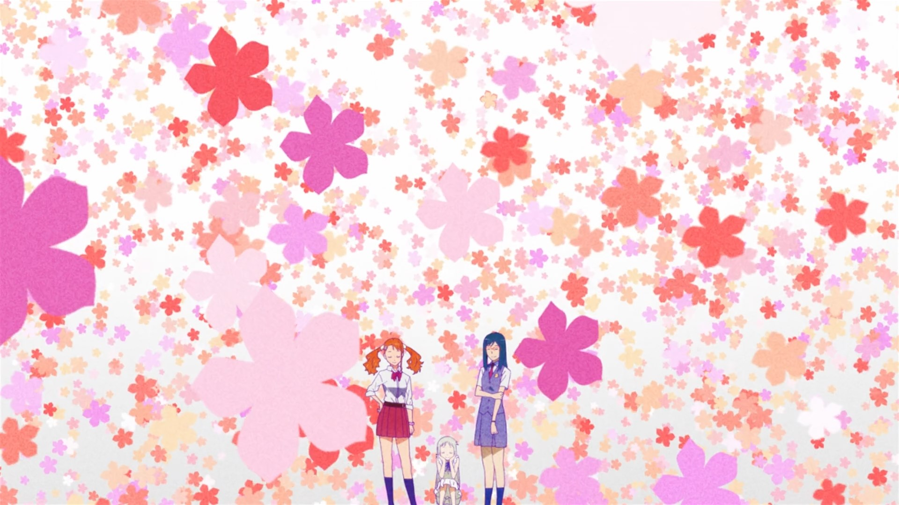

这次的电影版相当于总集篇+后日谈。简要地讲述了电视动画版的内容，间断加入一年之后的夏天的再次聚会的情节。时间切换的次数很多，上下文提示也不是很明显，估计对没看过电视版的人还是有点吃力吧。

这部作品在刚开始播放的时候被某些人封神，评价是感人而且治愈。这对我来说还是很为难的，因为我的感动点异外地难以捉摸。

我记得电视上播放最后一集的时候，是 11 年夏天，那天我通宵到早上，我是和朦胧的晨光一起欣赏了最后一集的。

当然不能说完全不感动，但是并没有撕心裂肺。就好像那个夏天之后，才意识到身边少了几个人，才会回想当初为什么没有那么伤感。

这个动画的长长的标题《あの日見た花の名前を僕達はまだ知らない。》，我没发现概括了作品的任何内容。倒是片尾曲《secret base ～君がくれたもの～》（秘密基地～你所给我的～）和本片密切相关，而且，我越来越觉得，本片应该是围绕着这首歌来写的。

这首歌是乐队组合 ZONE（凉宫里边的 ENOZ）在 2001 年的单曲，大意是描述与童年好友的欢乐时光，并提到在好友不得不转校的时候，约定于 10 年之后再会。动画于 10 年后的 2011 年播出，应该也不是完全的巧合。

我很喜欢这首歌，第一次听的时候就被吸引住了。这首歌讲述了童年的欢乐美好，还有分别时候的淡淡哀伤。让我自然而然地产生了共鸣。

动画中有六个童年好友。在他们童年时的小矛盾，因为其中的一位意外过世，而变得无法挽回的 10 年之后，每个人都活在这场悲剧的阴影之中。而以过世的好友以「幽灵」的形式（好吧，找不到一个特别贴切的词了）出现为契机，重新走到了一起，互相冰释前嫌，恢复了小时候的友谊。

他们在秘密基地再度聚首，并且在过世的好友不得不再次离开的时候，与她相互道别。尽管离别很悲伤，但是六个人的心灵相系，在各自的生活中都在前进。

这么一个与青春有关的充满欢乐与泪水的故事，和这首歌是在是太相配了。

那么扪心自问：为什么我没有那么感动呢？是因为没有过那么美妙的友谊，还是因为没有幽灵出现？

我最后劝说自己的结论是：我现在的生活一并不好，但回过头去，在童年也找不到可以救赎的地方。旧日已经远去，鲜艳的回忆已经让位给模糊的感觉，自我保护的壳已经硬化，我也不是十七岁了。

所以，虽然我能读得出剧中人物的感受，但也没有办法代入任何一个人去共鸣。只有片尾曲中分别时的感伤，以及 10 年后的约定，可以让我的心稍微触动一下了。
